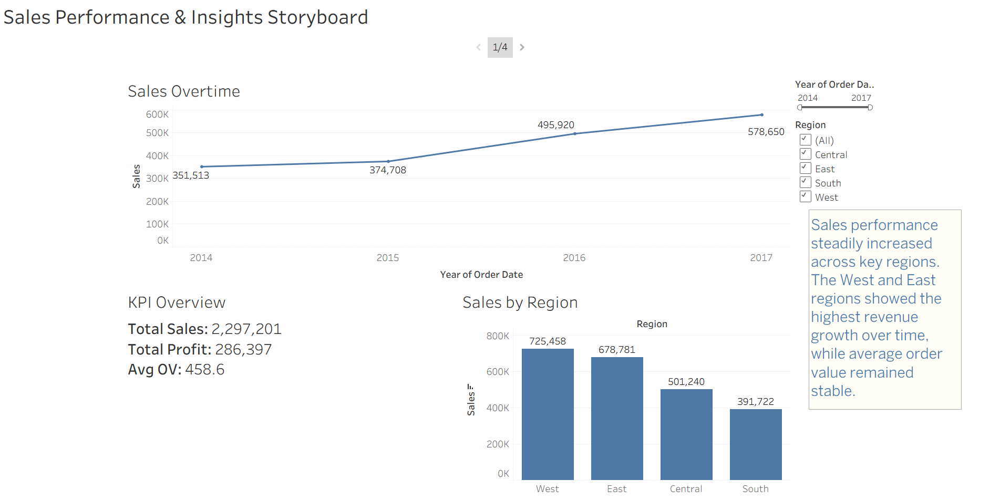
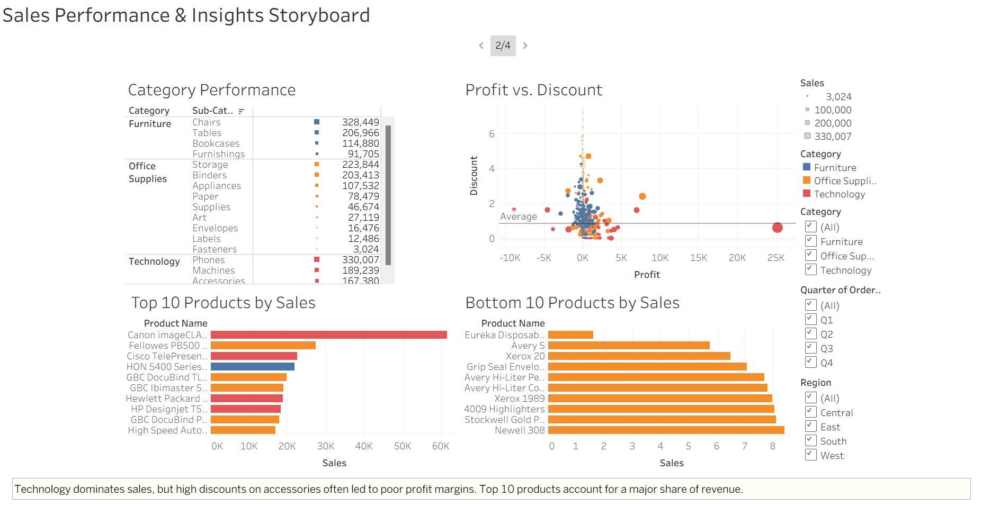
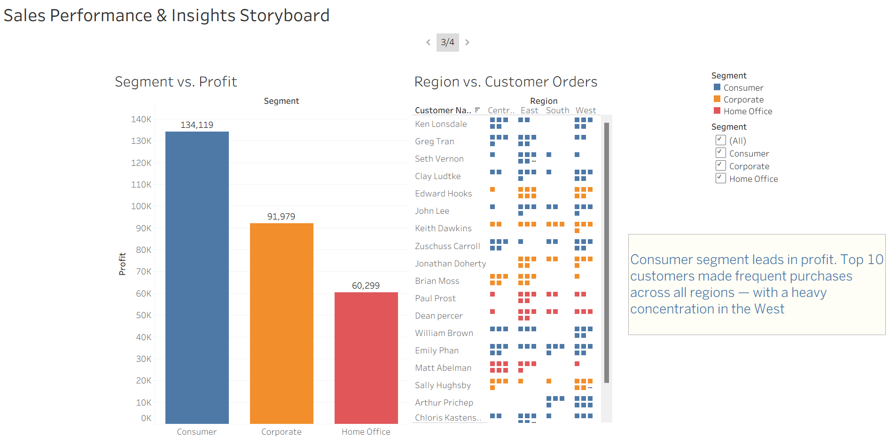
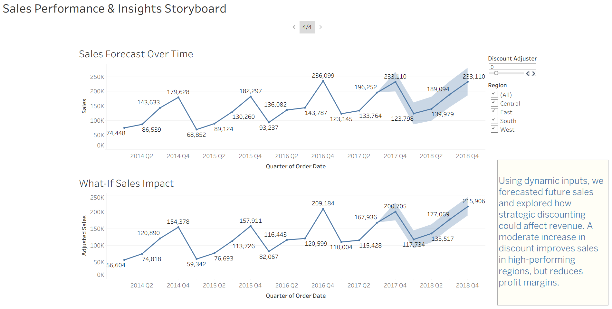

# 🛍️ Superstore Sales Analysis & Forecasting

A comprehensive data visualization project that analyzes sales performance, product trends, customer behavior, and forecasting using Tableau.

---

## 📁 Dataset

**Source**: Tableau Sample Dataset — [Superstore.xls](https://community.tableau.com/s/question/0D54T00000CWeBcSAL/sample-superstore-sales-excelxls)

- Rows: \~10,000
- Columns: 21
- Fields include: `Order Date`, `Sales`, `Profit`, `Discount`, `Customer ID`, `Segment`, `Region`, `Category`, `Sub-Category`

---

## 🧭 Project Objectives

- Analyze historical sales and profitability
- Understand customer and product-level performance
- Build interactive dashboards with filters and parameters
- Forecast future performance under dynamic scenarios
- Create a cohesive story using Tableau’s storytelling feature

---

## 📊 Dashboards Overview

### 📌 **Dashboard 1: Executive Summary**

- KPIs: Total Sales, Profit, Avg Order Value
- Line Chart: Sales over Time
- Bar Chart: Sales by Region
- Filters: Region, Category, Time Range

### 📌 **Dashboard 2: Product & Category Analysis**

- TreeMap: Sales by Category & Sub-Category
- Scatterplot: Profit vs. Discount
- Top 10 / Bottom 10 Products (by Sales)

### 📌 **Dashboard 3: Customer Behavior**

- Bar Chart: Segment vs. Profit
- Heatmap: Region vs. Customer Order Count
- Top 10 Customers by Order Volume

### 📌 **Dashboard 4: Forecast & What-If Planner**

- Tableau Forecast Model
- Discount Adjuster Parameter
- Region Selector
- Adjusted Sales vs. Forecasted Sales comparison

---

## 🧠 Key Insights

- 📈 **West Region** contributed the most to total sales across all years
- 💸 **High discounts** often led to **negative profits**, especially on Office Supplies
- 🏆 Top 10 products drove \~35% of revenue
- 👥 **Consumer Segment** yielded the highest profit margins
- 🔮 Forecasting shows a steady growth trend; however, excessive discounts reduce adjusted profit

---

## 📖 Story Points (Tableau Story Feature)

1. **Key Trends** — Highlights KPIs and regional growth
2. **Product Performance** — Identifies strong and weak-performing products
3. **Customer Segments** — Uncovers loyal customer patterns
4. **Strategic Forecast** — Simulates future growth under different scenarios

---

## 📸 Screenshots

> Embed images here after publishing your dashboards. Sample Markdown:

```




```

---

## 🚀 Tools & Technologies Used

- Tableau (Public)
- Excel (.xls)

---

## 🧰 Skills Showcased

- Data Analysis and Aggregation
- Data Visualization with Tableau
- Dashboard Design and UX
- Business KPI Interpretation
- Forecasting and What-If Scenario Simulation
- Parameter and Filter Configuration
- Data Storytelling and Presentation

---

## 🔭 Future Scope

- Integrate real-time data pipelines using Tableau Data Extract APIs
- Add advanced forecasting models using Python + Tableau integration
- Extend customer segmentation using clustering algorithms (RFM Analysis)
- Automate dashboard refreshes and reporting for live business use
- Embed dashboards into web apps or business portals for cross-functional access
- Include external datasets (e.g., economic indicators) for enriched insights

---

## 📎 Project Link (Optional)

- 📊 Tableau Public: [Link to Live Dashboards](#)


